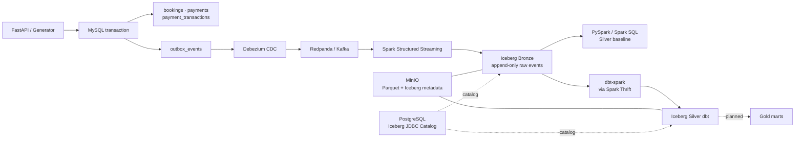

# ShopSlot Lakehouse

예약·결제 플랫폼의 운영 데이터를 **Transactional Outbox → Debezium CDC → Kafka/Redpanda → Spark → Apache Iceberg**로 전달하고, 재처리 가능한 Lakehouse를 구축한 데이터 엔지니어링 포트폴리오입니다.

가상의 다점포 서비스 `ShopSlot`을 대상으로 예약 생성·일정 변경·취소·체크인·노쇼와 수납·환불·재수납을 재현합니다. 실제 회사 코드나 고객 데이터는 사용하지 않습니다.

> 이 프로젝트는 현재 진행 중입니다. 아래 구조와 수치는 현재 구현·검증한 기준이며, 증분 처리·장애 복구·성능 실험 결과에 따라 데이터 모델과 기술 선택은 계속 변경될 수 있습니다. 구현하지 않은 항목은 로드맵으로 구분합니다.

## 프로젝트에서 다루는 문제

- 업무 데이터와 이벤트의 이중 쓰기 불일치를 Transactional Outbox로 줄입니다.
- CDC의 재전달과 스트리밍 재시작을 고려해 원문과 Kafka 위치를 Bronze에 보존합니다.
- 예약과 결제 이벤트를 공통 경계 이후 도메인별 Silver 모델로 분리합니다.
- 오류 이벤트를 버리지 않고 원문·사유·최초/마지막 발견 시각과 함께 `event_dq`에 관리합니다.
- PySpark 기준 결과와 dbt 모델을 나란히 실행해 SQL 변환 계층을 단계적으로 이관합니다.
- Iceberg snapshot, overwrite, MERGE와 checkpoint의 역할을 실제 장애·재실행 시나리오로 검증합니다.

## Architecture



### 구성 요소의 책임

| 구성 요소 | 책임 |
| --- | --- |
| MySQL + SQLAlchemy + Alembic | 예약·결제 운영 상태와 스키마 이력 관리 |
| Transactional Outbox | 업무 변경과 비즈니스 이벤트를 같은 DB 트랜잭션으로 기록 |
| Debezium + Redpanda | committed outbox 변경을 `booking.events.v1`으로 전달 |
| Spark Structured Streaming | Kafka 원문과 metadata를 Iceberg Bronze에 micro-batch 적재 |
| Apache Iceberg + MinIO | 객체 저장소 파일을 snapshot과 원자적 commit이 있는 테이블로 관리 |
| PostgreSQL JDBC Catalog | Iceberg 테이블 이름과 현재 metadata 위치 관리 |
| PySpark / Spark SQL | Silver 기준 결과, snapshot 고정, DQ MERGE 구현 |
| dbt-spark | SQL 모델 의존성, 테스트, 문서화와 단계적 Silver/Gold 이관 |

## 핵심 설계

### 1. 업무 변경과 이벤트를 한 트랜잭션으로 기록

예약 상태 변경이나 결제 거래가 발생하면 운영 테이블 변경과 `outbox_events` INSERT를 하나의 MySQL 트랜잭션에서 수행합니다. 애플리케이션이 DB와 Kafka에 각각 쓰는 구조에서 발생할 수 있는 한쪽만 성공하는 문제를 피하고, CDC의 재전달 가능성은 downstream의 `event_id` 중복 제거로 다룹니다.

### 2. Bronze는 원문을 보존

`lakehouse.bronze.booking_events`는 JSON 원문, Kafka key/header, topic/partition/offset, Kafka timestamp와 적재 시각을 append-only로 저장합니다. 파싱 실패나 업무 중복도 Bronze에서 제거하지 않아 Silver 규칙이 바뀌었을 때 다시 처리할 수 있습니다.

### 3. 공통 이벤트와 도메인 모델을 분리

```text
bronze.booking_events
  -> silver.events_clean
      -> silver.booking_events_clean -> silver.bookings_current
      -> silver.payment_events_clean -> silver.payments_current
      -> silver.event_dq
```

- `events_clean`: 공통 envelope 검증, `event_id` 중복 제거, 원문·Kafka lineage 보존
- `booking_events_clean`: 예약 lifecycle 5종 타입화와 도메인 계약 검증
- `payment_events_clean`: 결제 요청·수납·환불 타입화와 금액·상태 계약 검증
- `bookings_current`: 예약 한 건당 최신 상태와 생성 속성 재구성
- `payments_current`: 결제 한 건당 수납·환불·미수 현재 요약 재구성
- `event_dq`: 제외 이벤트를 `dq_key` 기준으로 멱등 MERGE

### 4. PySpark 기준선에서 dbt로 단계적 이관

기존 `lakehouse.silver` 결과를 기준선으로 유지하고 dbt 결과는 `lakehouse.silver_dbt`에 분리합니다. 첫 모델인 `booking_events_clean`은 예약 파싱·검증을 `ephemeral` 중간 모델로 분리하고, 기존 PySpark 결과와 양방향 `EXCEPT ALL` 비교를 통과해야 합니다.

dbt는 Spark를 대체하지 않습니다. dbt가 SQL·의존성·테스트를 관리하고 Spark Thrift가 SQL을 Spark에 전달하며, 실제 파일 저장과 snapshot commit은 Iceberg가 담당합니다.

## 데이터 시나리오와 검증 결과

고정 P0 데이터셋은 다음 lifecycle을 결정론적으로 생성합니다.

| 데이터 | 건수 |
| --- | ---: |
| 예약 | 10 |
| 결제 | 7 |
| 수납·환불 거래 | 13 |
| Outbox/Kafka 이벤트 | 40 |
| 예약 이벤트 | 20 |
| 결제 이벤트 | 20 |

포함 시나리오:

- 예약 생성, 일정 변경, 취소, 체크인, 노쇼
- 최초 부분수납과 완납
- 일반 부분·전액 환불
- 재수납이 필요한 환불과 완전·부분 재수납
- 잘못된 예약 가격과 결제 금액을 주입하는 DQ fixture

현재 확인한 범위:

- MySQL 결제 요약과 append-only 거래 합계 reconciliation
- Outbox에서 Kafka까지 40개 이벤트 전달
- Kafka/Bronze 원문·위치 양방향 비교와 중복 위치 검사
- 예약·결제 Silver clean 및 current 결과 생성
- DQ 재실행 시 동일 오류 행 중복 방지와 발견 시각 갱신
- dbt `booking_events_clean`과 PySpark 결과 각각 20행 일치
- dbt table 모델 1개와 데이터 테스트 8개 성공(`PASS=9`, `ERROR=0`)
- dbt 동일 입력 재실행 시 append 중복 없이 Iceberg overwrite snapshot 생성

## Quick start

### Requirements

- Docker Desktop 또는 Docker Engine
- Docker Compose v2
- `make`, Bash, `curl`
- `uv`는 Python 의존성을 변경할 때만 필요

### 최초 전체 흐름 실행

```bash
cp .env.example .env

# 주의: 기존 로컬 Docker volume을 삭제하고 P0를 다시 만든다.
make smoke

make iceberg-up
make bronze-stop
make bronze-once

make silver-events-clean
make silver-bookings-events
make silver-bookings-current
make silver-payment-events
make silver-payments-current

make dbt-booking-events
```

`make smoke`는 로컬 볼륨을 초기화하는 명령입니다. 기존 실험 데이터를 보존하려면 사용하지 말고 `make up`, `make migrate`, `make connector`, `make generate-p0`, `make verify-p0`를 필요한 단계만 실행합니다.

### 주요 확인 지점

| 도구 | 주소 / 연결 |
| --- | --- |
| Redpanda Console | `http://localhost:8084` |
| Debezium Connect | `http://localhost:8083` |
| MinIO Console | `http://localhost:9001` |
| Spark Thrift / DBeaver Hive JDBC | `jdbc:hive2://localhost:10000/` |
| Spark Thrift UI | `http://localhost:4042` |

DBeaver에서는 Apache Hive 드라이버와 사용자명 `spark`, 빈 비밀번호를 사용합니다. 로컬 학습용 무인증 구성으로 외부 공개를 전제하지 않습니다.

```sql
SHOW NAMESPACES IN lakehouse;
SHOW TABLES IN lakehouse.silver;
SHOW TABLES IN lakehouse.silver_dbt;

SELECT event_type, count(*)
FROM lakehouse.silver.booking_events_clean
GROUP BY event_type;
```

## Repository layout

```text
app/                 FastAPI, SQLAlchemy 운영 모델, outbox 서비스
alembic/             MySQL 스키마 migration
generator/           결정론적 P0와 추가/DQ 시나리오 생성기
debezium/            Outbox Event Router 설정과 등록 스크립트
spark/               Spark/Iceberg 런타임, Bronze·Silver Job과 SQL
dbt_shopslot/        dbt-spark 프로젝트, 모델과 데이터 테스트
scripts/             P0·Bronze 검증 스크립트
mysql/init/          MySQL 및 Debezium 계정 bootstrap
docs/                공개 기술 문서, 변경 기록, 트러블슈팅
docker-compose.yml   로컬 통합 실행 환경
Makefile             반복 실행 명령
```

## Documentation

- [문서 안내](docs/README.md) — 문서 범위와 구성 요소 선택 이유
- [Spark Bronze 가이드](docs/SPARK_GUIDE.md) — trigger, checkpoint, Kafka source와 Iceberg commit
- [Silver 변환 명세](docs/SILVER_GUIDE.md) — 테이블별 한 행의 기준, 검증 규칙과 증분 계획
- [dbt 실행 가이드](docs/DBT_GUIDE.md) — Spark Thrift 연결, 모델 구조와 실행 방법
- [변경 기록](docs/CHANGELOG.md) — 기능·계약·운영 방식의 변경과 검증 결과
- [트러블슈팅](docs/TROUBLESHOOTING.md) — 증상, 원인, 해결과 재검증 기록

## Current status and roadmap

현재 구현됨:

- 운영 스키마, Transactional Outbox, Debezium CDC와 Kafka 전달
- Kafka → Iceberg Bronze 스트리밍과 영속 checkpoint
- 예약·결제 Silver clean/current와 공통 `event_dq`
- Spark Thrift를 통한 DBeaver 조회
- dbt-spark 실행 환경과 첫 예약 Silver 비교 모델

다음 단계:

- dbt 기반 DQ MERGE와 빈 입력 보호
- 첫 Silver 모델의 Iceberg MERGE 증분 전환 및 full-refresh 결과 비교
- 늦은 이벤트, 실패 후 재시도와 snapshot 만료 시나리오
- Gold 일별 매장 지표와 reconciliation
- Airflow orchestration과 Iceberg snapshot/file maintenance
- 데이터 규모 확대 후 Spark 분산 실행과 MySQL 집계 성능 비교

현재 Spark는 단일 호스트 `local[2]`이고 Silver/dbt 모델은 full refresh 기준선입니다. 다중 노드 성능, 지속 유입 중 장애 복구, Gold와 운영용 인증·알림은 아직 완료된 성과로 주장하지 않습니다. 이후 실험에서 기존 가정이 틀린 것으로 확인되면 코드와 문서를 함께 수정하고 선택 근거와 결과를 변경 기록에 남깁니다.
